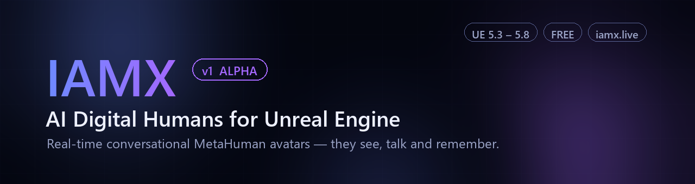

<p align="center">
  
</p>

<h1 align="center">Bring your characters to life.</h1>

<p align="center">
  <b>IAMX turns any character — a MetaHuman or your own custom rig — into a living, thinking digital human</b><br>
  that hears you, looks you in the eye, answers in real time with perfectly synced lips,<br>
  remembers you tomorrow, and can actually <i>do</i> things.
</p>

<p align="center">
  <a href="https://iamx.live"></a>
  <a href="../../releases"></a>
  <a href="../../issues"></a>
</p>

<p align="center">
  
  
  
  <a href="https://iamx.live/forum"></a>
  <a href="https://iamx.live/blog"></a>
</p>

---

> ### ⚠️ v1 **ALPHA**
> This is the first public release of IAMX. It works — we run it in production kiosks, live streams and demos — but you *will* find rough edges.
> **Your feedback genuinely shapes this product.** Every bug report and feature request gets read and prioritized: [open an issue](../../issues/new/choose) or post on the [forum](https://iamx.live/forum). It matters more than you think. 💜

---

<p align="center">
  
</p>

## ✨ What you get

| | Feature | What it means |
|---|---------|---------------|
| 🧍 | **Any avatar, not just MetaHuman** | MetaHuman works out of the box — and so does *your* character: Character Creator 3/4, iClone, Daz, Ready Player Me, or any skeletal mesh with blend shapes. |
| 🗣️ | **Real-time voice conversation** | Two-way, streamed, interruptible (barge-in). Speak — it answers in seconds, in 30+ languages. |
| 👄 | **Real-time lip sync + retarget** | The full facial performance follows every word — on MetaHumans *or* remapped onto your own rig's blend shapes. |
| 👁️ | **Eye & head tracking** | The character finds your camera and holds eye contact while you talk, like a person would. |
| 🧠 | **Your choice of AI brain** | GPT, Claude, Gemini (including Gemini Live realtime) or local Ollama — swappable per character from the panel. |
| 📷 | **Camera vision** | The character sees through a camera and reacts to what's actually in front of it. |
| 🎭 | **Emotion engine** | An 8-dimensional emotional core drives face, voice tone and gestures — and it changes as you talk. |
| 📖 | **Narrative / Scenario design** | A no-code visual graph editor for goals, decisions and branching, mission-driven dialogue. |
| 📚 | **Knowledge base (RAG)** | Your character answers from *your* documents, not the open internet. |
| 🙋 | **Long-term memory** | Recognizes returning people and remembers past sessions — across days, not turns. |
| ⚡ | **Actions** | Function calling into your APIs and your Blueprints — bookings, lookups, e-mail, calendar, in-game behavior. |
| 📡 | **Live streaming** | Run your character as an always-on AI stream host with a moderated queue and operator console. |
| 🎙️ | **Podcast mode** | Two characters hold an unscripted conversation with each other — on any topic you set. |
| 👥 | **Multi-character scenes** | Several characters per level; only the one you're near answers. They can even talk to each other. |
| 🖥️ | **Every surface** | Game NPC, 24/7 kiosk, one-line web embed, or cloud-streamed photoreal MetaHuman. |

Everything is configured live from the **[IAMX panel](https://iamx.live)** — save in the panel, see it in the character's next reply. No rebuilds, no redeploys.

> 🧩 **How it works:** the plugin is a lightweight client. The heavy AI runs in the IAMX cloud and streams back into Unreal frame-by-frame — your project stays lean, your machine stays cool, and every improvement we ship lands server-side without touching your build.

---

## 🧍 Works with *any* avatar — MetaHuman or your own

This is the part most tools get wrong. **IAMX is not MetaHuman-only.**

- **MetaHuman** — drop it in, it just works. The full face rig (jaw, lips, cheeks, brows) is driven for you.
- **Your own character** — Character Creator **3 / 4**, iClone, Daz, Ready Player Me, VRoid, a hand-sculpted hero, a stylized creature… if the mesh has **blend shapes / morph targets**, IAMX can drive its face.

### How the retarget works

The cloud sends a stream of neutral, rig-agnostic facial controls (visemes + expression signals). IAMX applies them either to the built-in MetaHuman controls **or**, for a custom character, to **your** blend-shape names through a simple mapping you fill in once on the component:

- Tick **`Use Custom Character Mapping`** on the IAMX component.
- Fill **`Custom Blend Shape Mapping`** — a table of *IAMX control → your mesh's blend-shape name* (e.g. `jawOpen → Merged_Open_Mouth`, `mouthSmile → A25_Jaw_Open`…). Character Creator and ARKit-style rigs map in minutes.
- Lip sync is written straight to your morph targets, so it layers cleanly over your existing body animation and state machines.

The result: **the same character you designed — voice, look, personality — talks and emotes with studio-grade lip sync, on whatever rig you already have.** No re-topology, no MetaHuman conversion.

> 💡 Eye and head tracking also work on custom rigs; for non-standard skeletons you point the look-at nodes at your own bones/controls.

---

## 🗣️ Conversation that feels alive

- **Streamed replies** — the character starts speaking while it's still thinking; no dead air.
- **Interruptible (barge-in)** — cut it off mid-sentence like you would a person; it stops and listens.
- **Echo-guarded** — it never mistakes its own voice from your speakers for user input.
- **30+ languages** — including English and Turkish, with natural, expressive voices.
- **Four ways to start talking:**

| Mode | Behavior |
|------|----------|
| **Push-to-talk** | Hold/press a key to speak (default `T`, configurable). |
| **Voice-activated** | Always listening; detects when you start and stop speaking. |
| **Wake word** | Sleeps until it hears its name — *"Hey Alara…"*. |
| **Proximity** | Give each NPC a radius; it only listens to the player standing near it. Walk away and it stops. |

## 🎭 A face that acts, not just talks

- **Lip sync** streams from the cloud frame-by-frame and drives the **full** facial performance — jaw, lips, cheeks, brows — not just an open/close mouth. Works on MetaHuman controls or your custom blend shapes.
- **Eyes and head** track the player's camera with natural limits and smoothing — three AnimGraph nodes that blend *non-destructively* on top of your existing animation.
- **Emotion engine:** every character carries an 8-axis emotional state (joy, trust, fear, surprise, sadness, disgust, anger, anticipation) that **decays over time** and **shifts with the conversation**. Mood drives facial expression, voice tone **and** body gestures — call your character rude and watch its face change. You can also read or nudge the emotional state from Blueprint.
- **Gestures:** conversation-driven body gestures fire automatically, and you can trigger your own from Blueprint (`Play Gesture`).

## 📖 Narrative & Scenario Design — direct your character

A **no-code visual graph editor**, right in the panel, for building guided, mission-driven characters instead of an open-ended chatbot:

- Chain **sections**, each with a goal — *"greet the visitor → understand their need → book a demo."*
- Add **decision branches** the AI evaluates from the conversation itself — no scripting, it reads intent.
- Fire **triggers** into your game or website the moment a branch is reached (wire them to `On NPC Event` / `On Action Triggered` in Blueprint).
- The character **stays in-character and on-mission** — it improvises the exact words, you own the story and the outcome.

Perfect for guided sales flows, museum & showroom tours, quest-giving NPCs, onboarding assistants and training simulations. This is the difference between "a character that chats" and "a character that *runs your scenario*."

## 📚 Knowledge & memory

- **Knowledge base (RAG):** upload PDF / TXT / CSV — even images — and your character grounds its answers in *your* content. Ask something covered by your docs, get *your* answer, not an internet guess. Files are managed per account and toggled per character.
- **Long-term memory:** the character summarizes each session and remembers returning visitors — *"Welcome back! Last time you asked about pricing…"* — across days, not just the current chat.
- **Face recognition** *(paid plans)*: on kiosks, it recognizes returning people by face and greets them by name.

## ⚡ Actions — a character that *does* things

IAMX characters can take real action, in two directions:

- **Into your APIs** — define HTTP GET/POST actions in the panel; the AI decides when to call them and answers naturally with the result (weather, stock, order status, your backend).
- **Into your Unreal project** — define **custom actions from Blueprint** (`Register Action`) and the AI triggers them in-world: move to, follow, play an animation, open a door, whatever you wire up.
- **Assistant actions:** e-mail, calendar, Telegram and WhatsApp out of the box.
- **Everything is an event:** replies, sentences, transcriptions, actions and lifecycle moments all fire Blueprint delegates, so your game logic can react to anything the character says or does. See the [Blueprint API](#-blueprint-api-quick-reference) below.

## 📡 Live streaming & podcast mode

<p align="center">
  
</p>

- **AI stream host:** run your character 24/7 as a live streamer. Viewer messages flow through a **moderated queue** — an operator console lets you approve, prioritize, reorder or inject messages while the character performs.
- **Podcast mode (NPC ↔ NPC):** two characters talk *to each other*, unscripted, on a topic you set — each with its own personality, voice and opinions. Drop in audience comments live. Great for AI talk shows, debates and background world-building.
- **Operator console:** watch the conversation live, steer it, and step in at any moment from the panel.

## 👥 Multi-character scenes

Put five characters in one level — each with its own personality, voice, model and knowledge. **Proximity gating** means only the NPC you're standing near hears you; the rest mind their own business. Characters can even hold conversations with **each other** (NPC-to-NPC).

<p align="center">
  
</p>
<p align="center"><sub>Every character is yours to design — personality, voice, look and mission.</sub></p>

## 🖥️ Beyond Unreal

The same character you build for Unreal also runs:

- **On your website** — one line of embed code, browser-native 3D avatar with voice.
- **As a LiveFace avatar** — a talking head from a single photo.
- **As a cloud MetaHuman** — photoreal, pixel-streamed straight to the browser, no install *(paid plans)*.
- **On 24/7 kiosks** — with identity verification and verified actions for regulated industries *(enterprise)*.

## 🎛️ The panel — mission control

Everything lives at **[iamx.live](https://iamx.live)**: personality, voice, AI model, features, knowledge files, scenarios, usage analytics and conversation reports. Change anything → the running character picks it up on its next session. **No rebuilds. Ever.**

▶ **See it live:** create a free account at **[iamx.live](https://iamx.live)** and talk to your first character in the browser playground before you even open Unreal.

---

## 🚀 Installation

### 1 — Get the plugin

Download the ZIP matching your engine version from **[Releases](../../releases)**:

| Engine | Package |
|--------|---------|
| UE 5.3 | `IAMX_UE5_3_Win64.zip` |
| UE 5.4 | `IAMX_UE5_4_Win64.zip` |
| UE 5.5 | `IAMX_UE5_5_Win64.zip` |
| UE 5.6 | `IAMX_UE5_6_Win64.zip` |
| UE 5.7 | `IAMX_UE5_7_Win64.zip` |
| UE 5.8 | `IAMX_UE5_8_Win64.zip` |

> ### 🔓 Windows: unblock the ZIP first (important!)
> Files downloaded from the internet are tagged "blocked" by Windows, which can stop Unreal from loading the plugin's binaries (symptom: text works but **no voice and no lip sync**). **Before extracting**, right-click the ZIP → **Properties** → tick **Unblock** → OK.
> Already extracted? Run this once in PowerShell inside the extracted `IAMX` folder:
> ```powershell
> Get-ChildItem -Recurse | Unblock-File
> ```

Extract the `IAMX` folder into your project's `Plugins/` directory (create it if it doesn't exist):

```
YourProject/
└── Plugins/
    └── IAMX/
        ├── IAMX.uplugin
        ├── Binaries/      ← prebuilt, ready to run
        └── Source/
```

Open the project — that's it. **The packages ship prebuilt Win64 binaries, so no compiler or Visual Studio is needed, and Blueprint-only projects work out of the box.** (Full source is included too — C++ projects can rebuild or step through it freely.) Also available on **Fab**.

> ⚠️ The ZIP must match your engine version exactly — a 5.3 package won't load in 5.4.

### 2 — Create your character (2 minutes)

1. Sign up free at **[iamx.live](https://iamx.live)**.
2. Create a character: personality, voice, language, AI model, features.
3. Copy the character's **connection ID** from the panel.

### 3 — Add the IAMX component

1. Drop your character into the level (a MetaHuman, or your own avatar actor).
2. Select it → **Add Component → IAMX**.
3. Paste your character's **connection ID** into the IAMX component's details.
4. Pick an **interaction mode** (Push-to-talk / Voice-activated / Wake word / Proximity).
5. *Custom (non-MetaHuman) avatar?* Tick **Use Custom Character Mapping** and fill the **Custom Blend Shape Mapping** table (see [Works with any avatar](#-works-with-any-avatar--metahuman-or-your-own)).

### 4 — Add the animation nodes

The plugin ships three AnimGraph nodes (right-click in any AnimGraph and search **"IAMX"**):

**Face Animation Blueprint** (e.g. `Face_AnimBP`) — add **two** nodes, chained before the Output Pose:

```
[ existing pose ] → [ IAMX Lip Sync ] → [ IAMX Eye Look At ] → [ Output Pose ]
```

- **IAMX Lip Sync** — applies the streamed facial performance (mouth, jaw, expressions) on top of the incoming pose.
- **IAMX Eye Look At** — makes the eyes find and track the player's camera during conversation.

**Body Animation Blueprint** (your character's body AnimBP) — add **one** node the same way:

```
[ existing pose ] → [ IAMX Head Look At ] → [ Output Pose ]
```

- **IAMX Head Look At** — turns the head (with natural limits and smoothing) toward the player while talking.

> 💡 All three edits are non-destructive: the IAMX nodes blend on top of whatever animation is already playing (idle, talk gestures, your own state machines).

### 5 — Start the conversation ⭐ (don't skip this)

The character connects to its cloud brain when you call **Start Conversation** — this is the one wire people miss. In your character's Blueprint (or the Level Blueprint):

```
Event BeginPlay ──▶ [ IAMX (component) ] ──▶ Start Conversation
```

That's it — one node off `Event BeginPlay`. From here you can also call `Start Listening`, `Send Text Input`, `Interrupt Speech`, and bind events like `On Response Ready` (see below). Call **End Conversation** when you want the character to disconnect.

### 6 — Press Play

In Push-to-talk mode, press **T** (default, configurable) and talk. In Voice-activated or Proximity mode, just speak / walk up to your character.

---

## 🔌 Blueprint API quick reference

Everything is exposed to Blueprint — no C++ required. The essentials:

**Call these (on the IAMX component):**

| Node | Does |
|------|------|
| `Start Conversation` / `End Conversation` | Connect to / disconnect from the cloud brain. |
| `Start Listening` / `Stop Listening` | Manually open/close the mic. |
| `Send Text Input` | Feed text instead of voice (chat box, quests, triggers). |
| `Interrupt Speech` | Cut the character off mid-sentence. |
| `Is In Conversation` / `Is Speaking` / `Is Listening` / `Is Processing` | State queries for your UI/logic. |
| `Set Mood` / `Set Context Fact` | Nudge personality or inject a runtime fact ("the store closes at 6"). |
| `Register Action` / `Unregister Action` | Define custom, AI-callable actions that fire in *your* Blueprint. |
| `Register Scene Object` / `Set Attention Object` | Tell the character what's around it and what to focus on. |
| `Play Gesture` | Trigger a body gesture. |
| `Force Set Emotion` / `Reset Emotion` / `Get Emotion Score` | Read or drive the 8-axis mood. |
| `Start Podcast` / `Start Npc Conversation` | Kick off podcast mode / an NPC-to-NPC chat. |
| `Update Character` / `Load From Panel API` | Hot-reload the character's panel config at runtime. |

**Bind to these events:**

| Event | Fires when |
|-------|-----------|
| `On Conversation Started` / `On Conversation Ended` | The session opens / closes. |
| `On Speaking Started` / `On Speaking Stopped` | The character starts / finishes talking. |
| `On Listening Started` / `On Listening Stopped` | The mic opens / closes. |
| `On Response Ready` | A full reply is ready. |
| `On Sentence Spoken` | Each sentence, as it's voiced (great for subtitles). |
| `On Player Speech Transcribed` | The user's speech has been transcribed. |
| `On Action Triggered` / `On Action Received` | The AI called one of your actions. |
| `On Emotion State Changed` | The 8-axis mood updated. |
| `On Person Detected` / `On Person Gone` | Face recognition sees / loses a person *(paid)*. |
| `On Identity Verified` | ID + face match completed *(enterprise)*. |
| `On Perceived Object` / `On Attention Changed` | The character noticed something / shifted focus. |

---

## 📋 Requirements

- Unreal Engine **5.3 – 5.8** (Win64) — Blueprint-only projects supported (binaries are prebuilt)
- A free **[iamx.live](https://iamx.live)** account
- A microphone

## 🐞 Known alpha limitations

- Win64 only (other platforms on the roadmap)
- MetaHuman rigs are one-click; custom rigs work great but need the blend-shape mapping filled in once
- Documentation is still growing — when in doubt, [ask](../../issues); it also tells us what to write next

---

## 💬 Feedback — seriously, we want it

This is an alpha. The fastest way to get a feature or a fix is to tell us:

- 🐛 **[Report a bug](../../issues/new?template=bug_report.yml)** — engine version + logs = fixed fast
- 💡 **[Request a feature](../../issues/new?template=feature_request.yml)** — tell us what you're building
- 🗣️ **[Join the forum](https://iamx.live/forum)** — questions, showcases, roadmap talk
- 📰 **[Read the blog](https://iamx.live/blog)** — release notes and deep dives
- ⭐ **Star the repo** if this is useful — it genuinely helps others find it

## 📄 License

Free to use, including commercially, with the IAMX service — see [LICENSE](LICENSE.md).

<p align="center">
  <sub>Built with obsession by <a href="https://iamx.live">IAMX Interactive</a> · <a href="https://iamx.live">iamx.live</a> · <a href="https://iamx.live/forum">forum</a> · <a href="https://iamx.live/blog">blog</a></sub>
</p>
